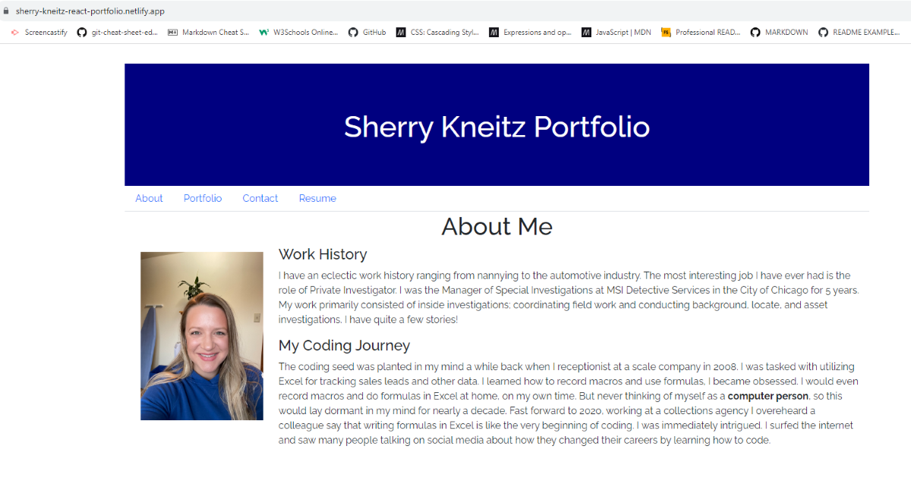

# React-Portfolio

## Description

I wanted to develop a website using React that serves as a portfolio, meticulously highlighting the diverse array of my achievements during my intensive bootcamp training. It provides a comprehensive insight into my personal journey, shedding light on the formative experiences that kindled my profound interest in the dynamic and captivating realm of web development.

## Technologies Used

ReactJS - Used to build elements of page including header, nav-bar, core content which changes based on user interaction, and footer
JavaScript - Used to create seeds, routes, and models
HTML - Used within handlebars for frontend of site
CSS - Used to create look and reactivity of site

## Installation

To install code, run the following command:
Git clone <paste SSH key>

## Deployed Link

https://sherry-kneitz-react-portfolio.netlify.app/

## Overview of Site

## Summary

Built components for header, nav-bar, core content
Built components for those components including projects, pages, about, portfolio, contact, and resume
Built data to populate each section, allowing quick updates as developer only needs to edit the data to change the content rather than go into each component to make changes
